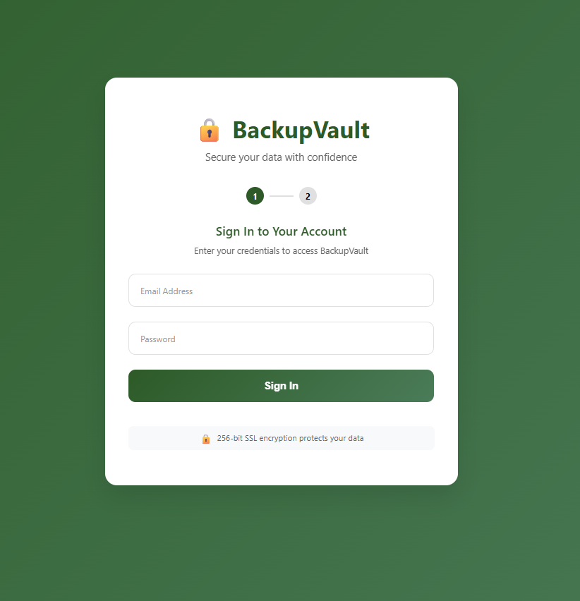
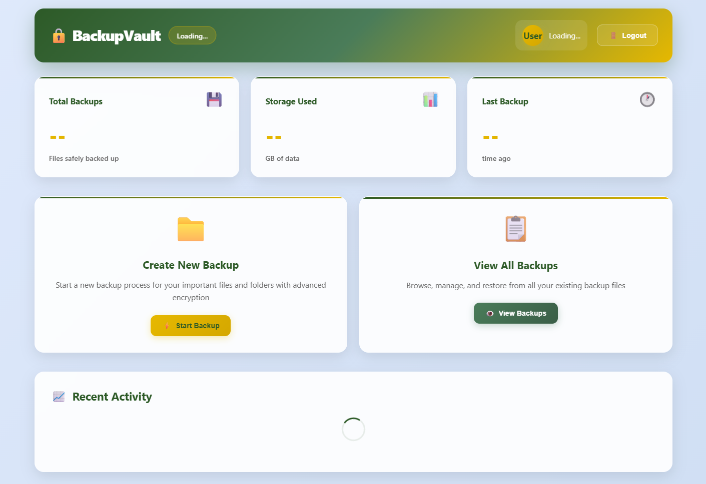

# Back-up feature

## Installation
1. Clone the repository:
    ```bash
    git clone https://github.com/theurikarue/backup.git
    cd backup
    ```

2. Install live-server:
    - On Windows and :
        ```bash
        npm install -g live-server
        ```
    - On Unix or MacOS:
        ```bash
        sudo npm install -g live-server
        ```

3. Run live-server in the backup folder:
    ```bash
    live-server
    ```

4. Add your APIs where necessary:
   * in the index.js file
    ```bash
    const API_CONFIG = {
            LOGIN_URL: '{your_login_api}',
            VERIFY_OTP_URL: '{your_verify-otp_api}',
            DASHBOARD_URL: 'dashboard.html'
        };
    ```
    
   * in the dashboard.js file
    ```bash
     const API_CONFIG = {
            BACKUP_SERVICES_API: '{your_backup__api}',
            LOGIN_URL: 'index.html'
        };
    ```

## UI DESIGNS
### Login page 


### Dashboard 

